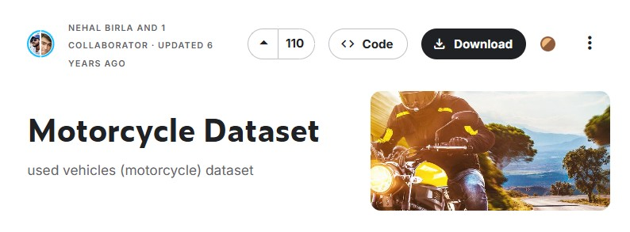

# Multi-AI Dashboard 
### Motorcycle Price Prediction & Cloud Classification

---

  
  

*An integrated AI solution for vehicle valuation and meteorological image analysis.*

## Overview
This repository contains a dual-purpose AI application built with **Streamlit**. It demonstrates the implementation of both **Machine Learning (Regression)** and **Deep Learning (Image Classification)** in a single, user-friendly interface.

---

## Key Features

### 1. Motorcycle Price Predictor
- **Ensemble Model:** Uses a `Voting Regressor` (Linear Regression + Random Forest + XGBoost).
- **Smart Logic:** Includes custom post-processing to handle price capping and depreciation based on ownership and mileage.
- **Accuracy:** **78% R2 Score**.

### 2. Cloud Image Classifier
- **Deep Learning:** Built on a **Convolutional Neural Network (CNN)** architecture.
- **Multi-class:** Capable of identifying 7 different cloud formations.
- **Confidence Scoring:** Real-time probability estimation for each classification.
